# Assembly

This document describes how to assemble the [ULX3S](https://ulx3s.github.io/) enclosure for the [Elecrow 7 inch display](https://www.amazon.com/dp/B08FMNDDSL).

There are several similar displays. This enclosure is designed for the following model:

> "_ELECROW 7 Inch Touchscreen Monitor for Raspberry Pi - 1024x600 IPS Capacitive Touch Screen HD Mini LCD Display with Stand Compatible with Raspberry Pi 5/4B/3B+/3B, BB Black_".

Note: This display model has no visible front-facing mounting tabs with screw holes, unlike some similar displays.

If a display is not used, there's an optional blank panel mock-up available instead. See the related `Display Mockup` files.

## Licensing and Marketing Affiliation

The enclosure is open source, with a paid commercial license available. See the [LICENSE](./LICENSE.md) file.

There are no paid marketing affiliations. Related product links are included for convenience only.

## Before You Start

- Verify all printed parts are free of defects

- Confirm you have all required screws and inserts

- Test-fit critical components before final assembly

- Read all instructions at least once before beginning

- Review the minor [Compatibility Issues](https://github.com/gojimmypi/ulx3s-elecrow-7inch-hdmi-enclosure?tab=readme-ov-file#compatibility-issues) in the main README file.

## Common Mistakes

- Using the wrong HDMI connector (only A1-A1 fits)

- Installing inserts too hot (causes deformation)

- Blocking internal support posts with wires

- Cutting light pipes too long (causes enclosure bulge)

## Tips for Success

Pre-read all instructions to the end before proceeding.

Re-read all instructions before proceeding. (Yes repeated here, Read the fine manual!)

- For any project using screws, consider [thread locker purple](https://www.amazon.com/dp/B000HBGHFY).

- When multiple screws are used in a given assembly piece, insert them all first and then gradually tighten them in opposite corner order succession.

- Metal threaded inserts may possibly be inserted without heating. This is not advised. Use care.

- A soldering iron without a temperature adjuster can be hundreds of degrees too hot for use with threaded inserts,
particularly the small ones used here. A [vertical heat set press tool](https://www.amazon.com/dp/B0DHKPHKJZ) works well.

- When using a heat-set tool, beware that the brass heating end looks very similar to the brass insert. Do not press any insert beyond the depth of the part face.

- Hex head screws are generally easier to install as compared to Philips (cross) or slotted screws.

- Use caution when subjecting plastic parts to mechanical stress. Ensure there's no debris, strings, or other print-time errors. Consider sanding to fit rather than using force.

- Consider optional internal speaker placement. The default orientation may be problematic. Install speakers last.

- As the buttons are very small, an accent color can optionally be added to the engraved symbols on the surface of the buttons prior to assembly.

- Ensure any internal electrical connectors are free of debris before beginning assembly.

- If there's a smooth end on the screw heat-set inserts, that end goes in first.

- Practice on the light block sample before attempting to insert fiber optic light pipes in the enclosure face.

## Key Measurements

- Minimum 4.9 mm clearance for buttons. Current: 3.4 mm distance, 2.1 mm base, 1 mm face offset
- Mechanical fit is typically 0.1 mm or 0.15 mm
- Parts were designed and printed assuming a 0.4 mm nozzle and 0.15 mm layer height.
- 3D printed in 25C (80F) ambient environment, with no brim, on a textured sheet, cleaned with IPA before each use.

## Parts List

Most parts are 3D printed. Tested with [Creality PETG 3D Printer Filament 1.75 mm](https://www.amazon.com/dp/B0C8NP63GD) and [Prusament PETG Jet Black](https://www.prusa3d.com/product/prusament-petg-jet-black-1kg/).

Mechanical connections are made with either 3D printed friction clips or heat-set brass inserts and metal screws as needed.

The [Elecrow 7 inch display](https://www.amazon.com/dp/B08FMNDDSL) includes some mounting parts and speakers.

An optional [internal 20 mm (0.79 in) x 10 mm fan](https://www.amazon.com/dp/B07KS36L66) can be used. Note voltage requirements.

### Heat Set Inserts

For most of the enclosure, M3 inserts are used. There are 6 M2.5 screws used with the optional display mock-up, or 8 if you include the 2 unused positions.

Two M2 screws inserts are needed for the optional OLED frame.

Use an insert temperature of about 210 C. Insert gently and steadily. Avoid moving too slowly, as excessive heat can deform the plastic.

### ULX3S Enclosure Internal

- 4 each: M3 x D4 x L8,  internal tall posts
- 2 each: M3 x D4 x L4,  internal short plastic posts
- 4 each: M3 x D4 x L4,  bottom mounting plate holes; two different mounting plates depending on default Philips or hex drive screws.

### ULX3S to Elecrow Adapter Bracket

- 4 each: M3 x D4 x L4,  adapter hole for mounting ULX3S to display
- 2 each: M3 x D4 x L4,  adapter base plate spacer hole
- 1 each: M3 x D4 x L4,  adapter hole for securing USB strain relief cover

### Display Blank Mock-up

- 2 each: M2.5 x D3.5 x L4,  short HDMI display posts
- 4 each: M2.5 x D3.5 x L4,  RPi / ULX3S adapter posts

### ULX3S Enclosure External

- 2 each: M2 x D4 x L4,  OLED face frame screws

### Screws

Hex head screws generally work best. Most of the ones used for this project are flat head, flush screws.

- 4 each: M3 x 8 internal tall posts; longer screws up to 18 mm can be used.

- 2 each: M2 x 10 mm OLED face frame; exact length: 8 mm does not reach, 12 mm bottoms out.

TODO finish this list, see above

## Tools

- Soldering Iron
- Heat-set insertion tool
- Screwdriver (optional; recommend using hex screws instead)
- Hex wrenches:

| Thread | Socket Cap | Flat (Flush) |
| ------ | ---------- | ------------ |
| M2     | 1.5 mm     | 1.3 mm       |
| M2.5   | 2.0 mm     | 1.5 mm       |
| M3     | 2.5 mm     | 2.0 mm       |

## 3D Printed Parts

In addition to the enclosure main body front and back, there are a variety of other parts that can optionally be used.

<a href="./images/enclosure_parts.png" target="_blank">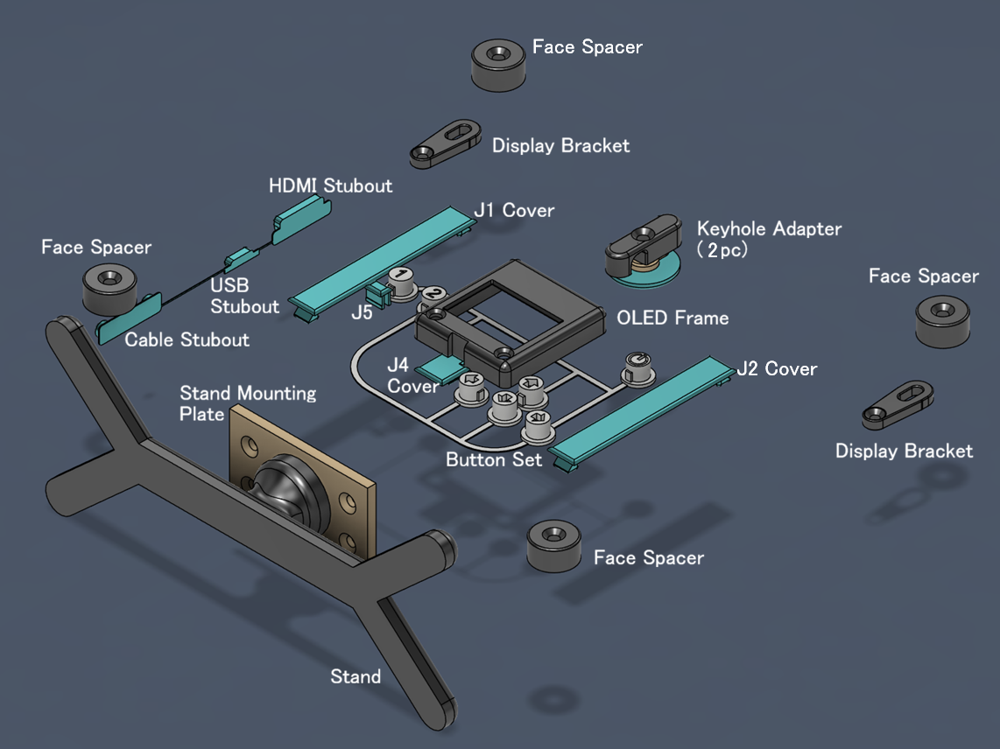</a>

| Part | Description |
| ---- | ----------- |
| <a href="./images/part_ULX3S_To_RPi_Elecrow_Adapter.jpg" target="_blank">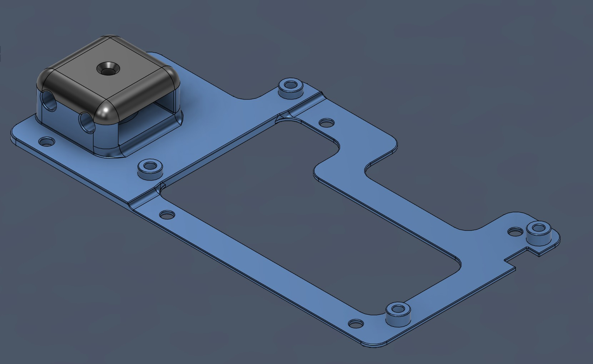</a> | Adapter Mounting Bracket with internal USB restraint |
| <a href="./images/part_USB_restraint_cap.jpg" target="_blank">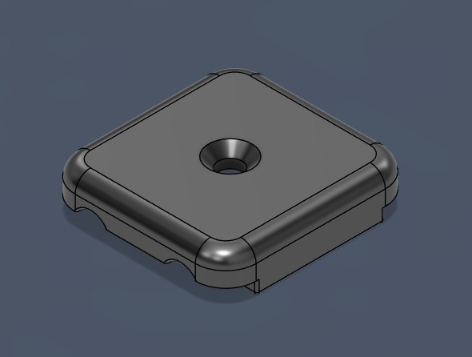</a> | Adapter Mounting Bracket USB Restraint Cap |
| <a href="./images/part_adapter_spacer.jpg" target="_blank">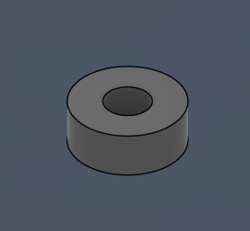</a> | Adapter Mounting Bracket Underside Spacers |
| <a href="./images/part_button_set.jpg" target="_blank">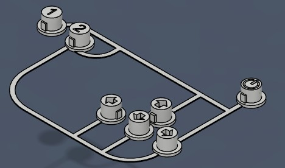</a> | Button Set (printed as a single connected piece for handling) |
| <a href="./images/part_display_bracket.jpg" target="_blank">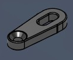</a> | Display Bracket (2x); Philips default, see alternative Hex Head screw files. |
| <a href="./images/part_display_mockup_blank.jpg" target="_blank">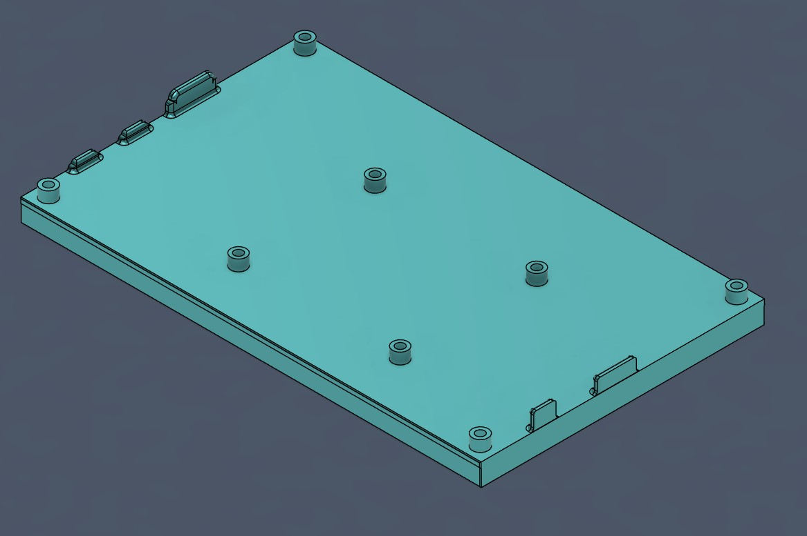</a> | Display Mock-up Blank |
| <a href="./images/part_enclosure_ulx3s_side.jpg" target="_blank">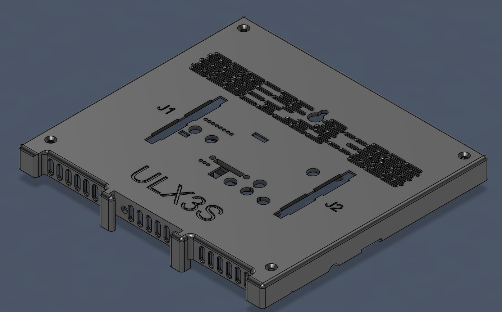</a> | Enclosure ULX3S Side |
| <a href="./images/part_enclosure_display_side.jpg" target="_blank">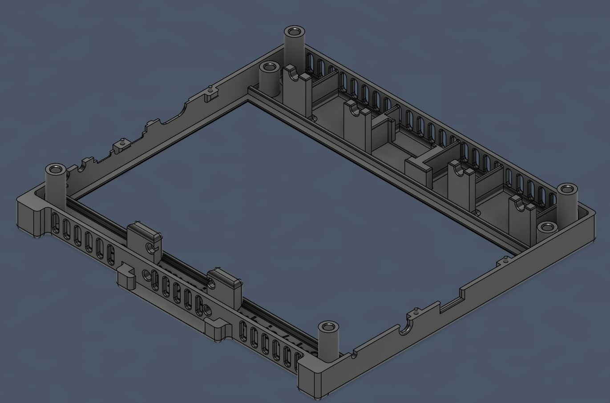</a> | Enclosure Display Side |
| <a href="./images/part_face_spacer.jpg" target="_blank">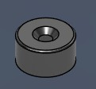</a> | Face Spacer (4x) |
|  | J1 Cover |
| <a href="./images/part_j2_cover.jpg" target="_blank">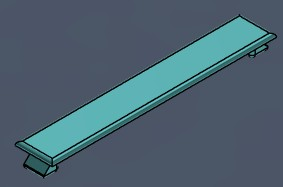</a> | J2 Cover |
|  | J3 Cover |
|  | J4 Cover |
| <a href="./images/part_keyhole_adapter.jpg" target="_blank">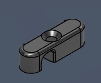</a> | Keyhole Adapter |
| <a href="./images/part_keyhole_face_insert.jpg" target="_blank">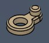</a> | Keyhole Face Insert |
| <a href="./images/part_keyhole_internal_disc.jpg" target="_blank">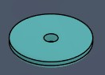</a> | Keyhole Internal Disc |
| <a href="./images/part_light_pipe_sample.jpg" target="_blank">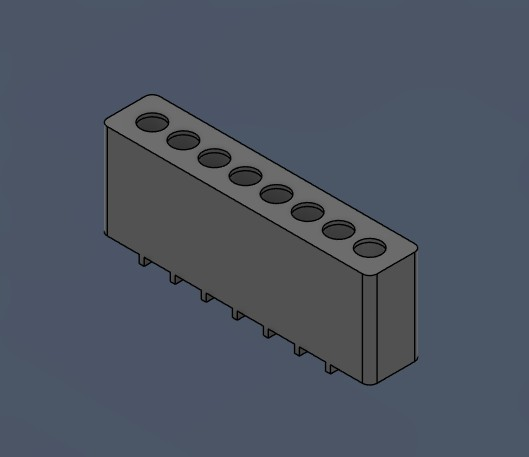</a> | Light Pipe Sample (not part of the assembly; used to test optic fit)
| <a href="./images/part_oled_frame.jpg" target="_blank">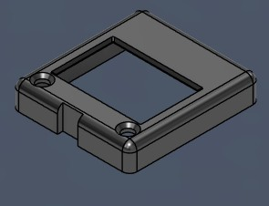</a> | OLED Frame |
| <a href="./images/part_stand.jpg" target="_blank">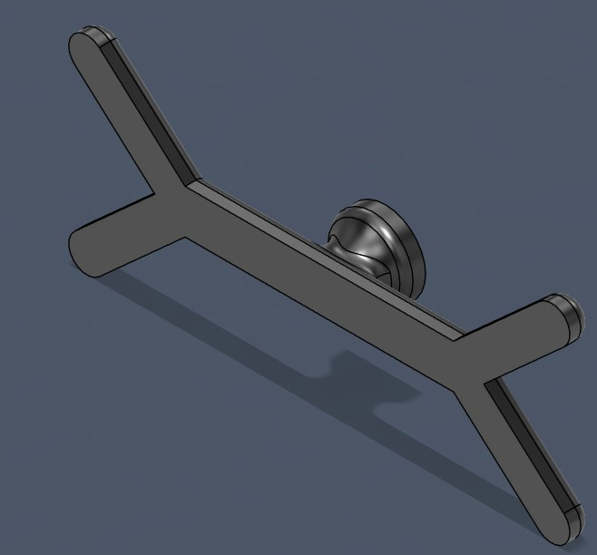</a> | Stand |
| <a href="./images/part_stand_mounting_plate.jpg" target="_blank">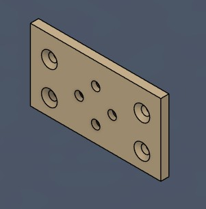</a> | Stand Mounting Plate; Philips default, see alternative Hex Head screw files |
| <a href="./images/part_stubout_set.jpg" target="_blank">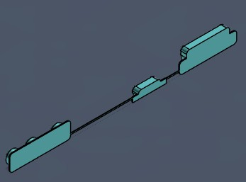</a> | Stub-out Set |

## Instructions

Begin by inspecting all plastic parts that may have been printed with minor imperfections, strings, or brims that need to be trimmed.

If a more polished enclosure is desired, see the ["Spray Paint Finish Process: Fantastic Surface technique for prototype Models & Mock ups" on YouTube](https://youtu.be/0Z-cBnH79J4):

## Solder Desired Headers to ULX3S

The ULX3S side of the enclosure is designed for very exacting mechanical fit. Ensure all soldered headers are reasonably perpendicular to the ULX3S board.
This is particularly important for the single-row connectors such as the `OLED1` connector.

There are optional headers that may need to be soldered to the ULX3S board:

- `OLED` for use with the SSD-1331 display on the opposite side of the enclosure
- 40-pin `J1` and `J2` for GPIO, power and ground
- J3 (`GND` and WIFI_OFF: `ESP32 EN`)
- J4 JTAG 6 pin header: `3v3`, `GND`, `TDO`, `TDI`, `TCK`, `TMS`.
- J5 (VJ1) `+3v3` and `+2v5`, pin 2 is `2V5_3V3` (note: inaccessible from front panel when using the OLED frame)

Note: The fan connector on the Elecrow 7 inch display collides with pins on ULX3S J2 when using a block header. Trim the plastic housing and/or the J2 header pins on the underside of the board.

<a href="./images/ULX3S-clearance-view-fan-highlight.jpg" target="_blank">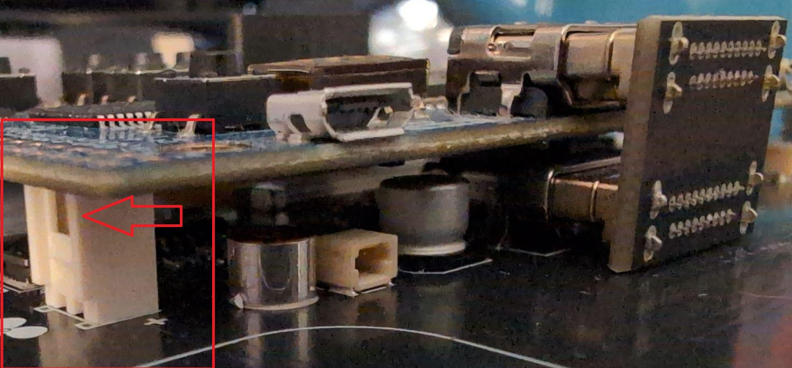</a>

## Install Heat-Set Inserts

### Install Brass Inserts on Display Side

Install 4 of the M3 brass heat-set inserts on the tall enclosure posts.

CAUTION: These are the most important mechanical connections, holding the enclosure together. Do not apply too much heat that may deform the posts.

<a href="./images/enclosure_display_side-tall_post_insert-note.jpg" target="_blank">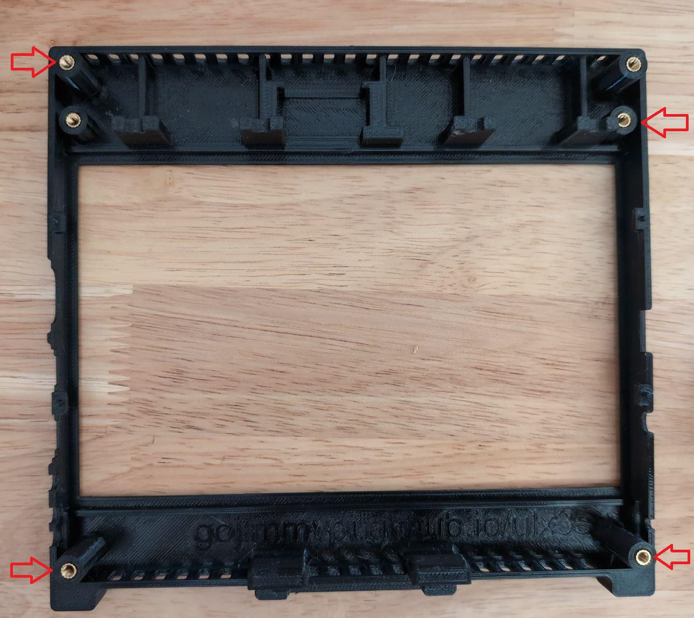</a>

Install M3 brass inserts on each of the two shorter bracket posts near the top of the display.

<a href="./images/enclosure_display_side-display_bracket_note.jpg" target="_blank">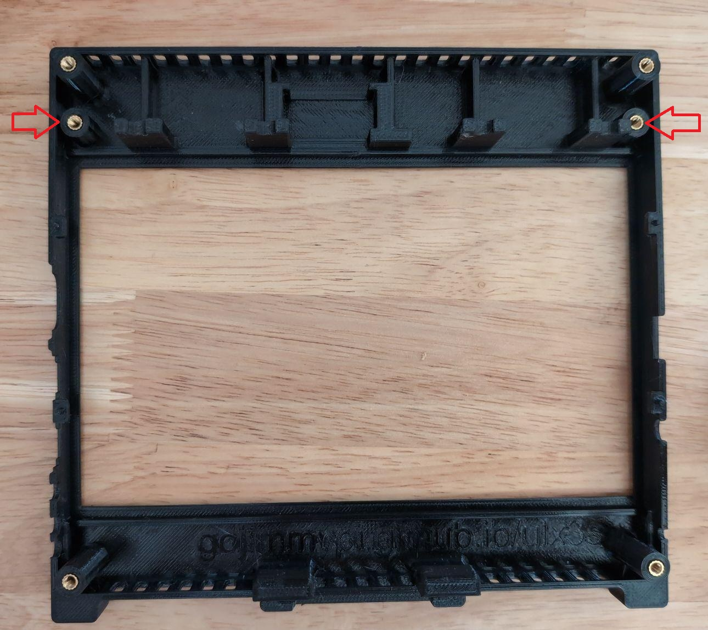</a>

Note that the display brackets are used only on the top two posts for vertical adjustment as needed.
All measurements are with respect to the PC board on the Elecrow display.
There is no reference for the position of the LCD display relative to the PC board,
so there's a bit of wiggle room built in, just in case.

The bottom of the display should rest against the stop on the side panel:

<a href="./images/enclosure_display_side-positioning_stop.jpg" target="_blank">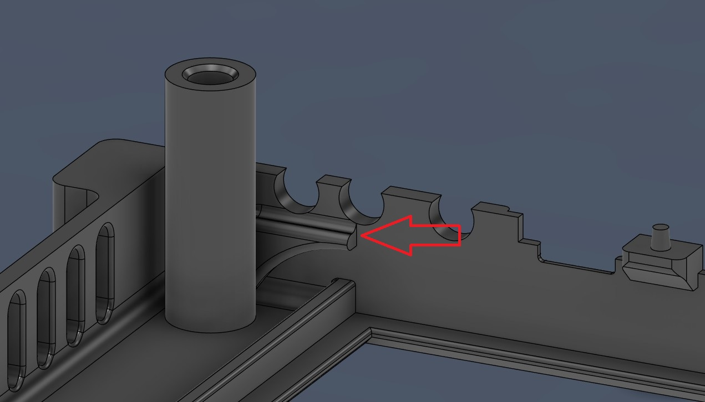</a>

Double-check that the USB, HDMI, and audio holes align properly.

All 4 display posts are also secured internally from above via these posts on the ULX3S side:

<a href="./images/enclosure_ulx3s_side-display_post_note.jpg" target="_blank">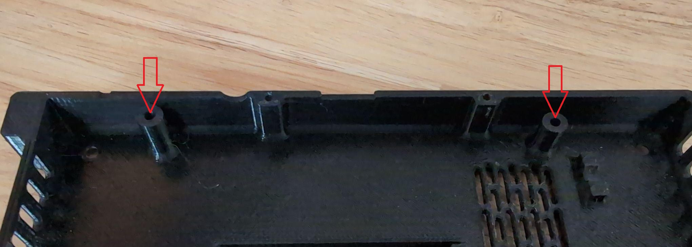</a>

Ensure that appropriate flush screws are used for the display mounting brackets and no internal wires are placed over the display
mounting posts. Otherwise, the enclosure sides may not properly fit.

There are two different mounting plates: the default if for a Philips screw with a 1.3 mm chamfer. There are alternative hex screw files for hex drive screws with a 2 mm chamfer. See files with `(Hex Head)` name suffix.

The Philips hole with a hex screw results in a nearly 1 mm clearance problem:

<a href="./images/hex_vs_philips_chamfer_fit.jpg" target="_blank">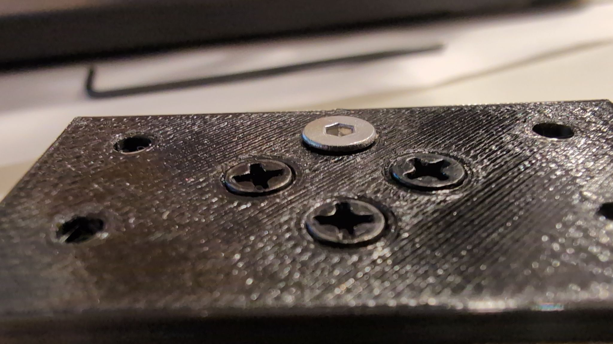</a>

Setting all the holes to the 2 mm hex size results in Philips screws being recessed too far.

Choose a mounting plate for the screws used, then install the 4 bottom mounting plate M3 heat inserts in the base of the enclosure display side:

<a href="./images/enclosure_stand_mounting_bracket.jpg" target="_blank">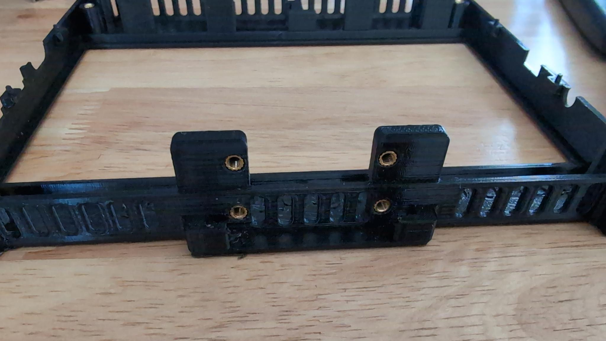</a>

### Install Brass OLED Frame Mounting Screw Inserts on ULX3S Face Side

The OLED display side uses smaller M2 screws to secure the SSD 1331 PCB and OLED face frame to the enclosure.

When using the optional [OLED 1331 display](https://www.amazon.com/dp/B0711RKXB5), install two `M2x4x3.5` brass inserts in the front panel.

Be sure to support the enclosure from below to ensure not deforming or cracking the plastic face, particularly if not using a heat set insert tool.

<a href="./images/press_fit_OLED_screws.jpg" target="_blank">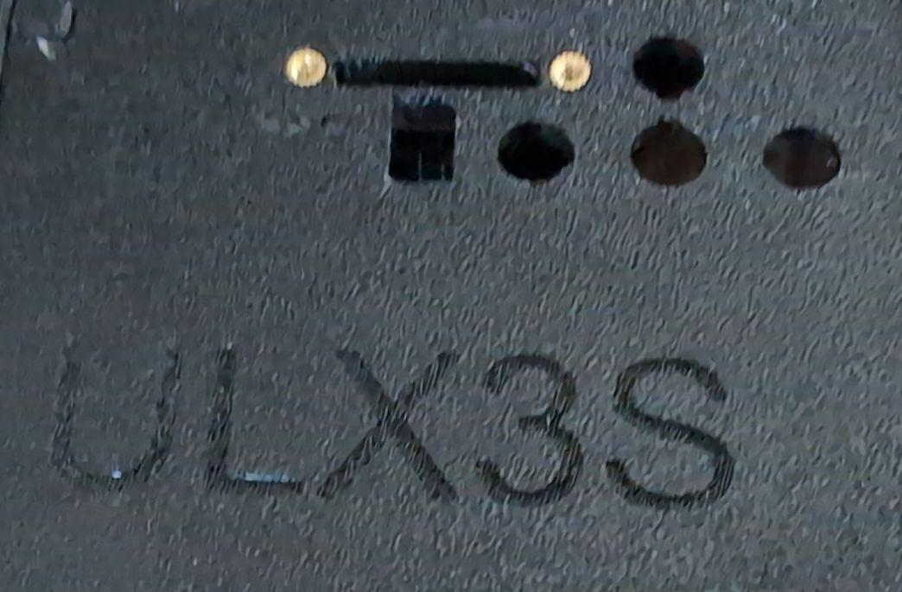</a>

Only install the inserts. Do not mount the OLED screen at this time to allow the display to lay flat later during assembly.

### Light Pipe Block (Optional)

There are 8 general purpose LEDs and 3 system LEDs on the ULX3S that can be better illuminated on the enclosure face with [2 mm (0.08 inch) fiber optic light pipes](https://www.amazon.com/dp/B0BLH9TSHV).

When using 2 mm fiber optic pipes, the fit is rather tight in the holes due to dimensional constraints when using a 0.4 mm 3D printer nozzle: 2.54 mm between holes.

The light pipe blocks have holes positioned directly over the LEDs on the ULX3S board. To improve brightness on the enclosure face, optional fiber optic filament can be inserted into each hole.

Do not precut the fiber optic filament line for the light pipes unless you have a means for accurate sizing and inserting.

Consider polishing the cut end before inserting. Deformation on the end may make insertion more difficult.
A nicely polished end will also transmit light more effectively. Here's a close-up view of the fiber light tube that was cut with diagonal snips:

<a href="./images/light_pipe_rough.jpg" target="_blank">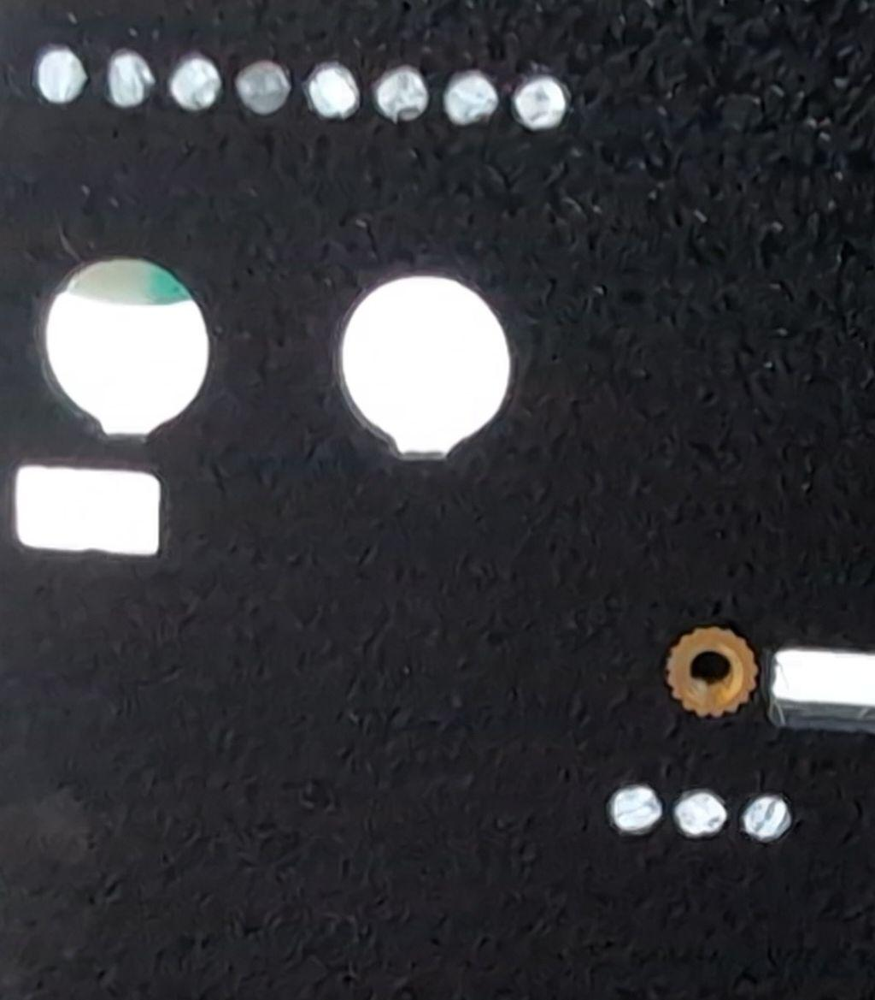</a>

The holes for the filament are purposely snug to retain the light pipe with no glue or other mechanical connectors.

Clean out each hole using a long M2 screw (10 mm or longer) to remove any debris or print artifacts.

Note that there's a small lip at the face to help retain the light pipe from being pushed too far.  Excessive force can damage this and push the filament out.

<a href="./images/light_pipe_analysis_split_view.jpg" target="_blank">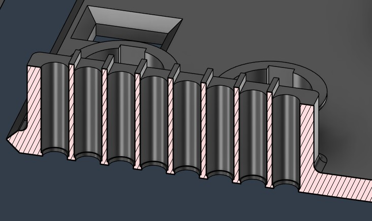</a>

Ensure the ULX3S side is firmly placed face-down with no obstructions.

Firmly insert a length of fiber optic filament into each of the 8 LED holes and the 3 diagnostic LEDs.

After each filament is inserted, check the face to ensure the filament nearly reaches the face surface for best results.

Cut the filament, then push the remainder to be flush with the light block _below the level of the light fences_.
Note the light fences between each hole in the light block:

<a href="./images/light_pipe_fence.jpg" target="_blank">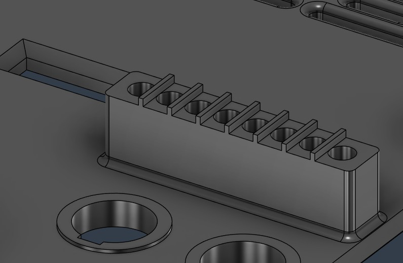</a>

These fences are designed to limit any cross-LED light contamination to a neighboring hole.
The light pipe _block_ should reach the _level of the LEDs_ on the ULX3S board when assembled.
The fences extend _beyond_ this and are positioned _between_ each LED. The fence nearly touches the PC board.

Worst case, use fine sandpaper to polish everything down to the light pipe block.
Removing the fences typically has minimal impact given the brightness of the LEDs but is not very pretty:

<a href="./images/light_pipe_mishap.jpg" target="_blank">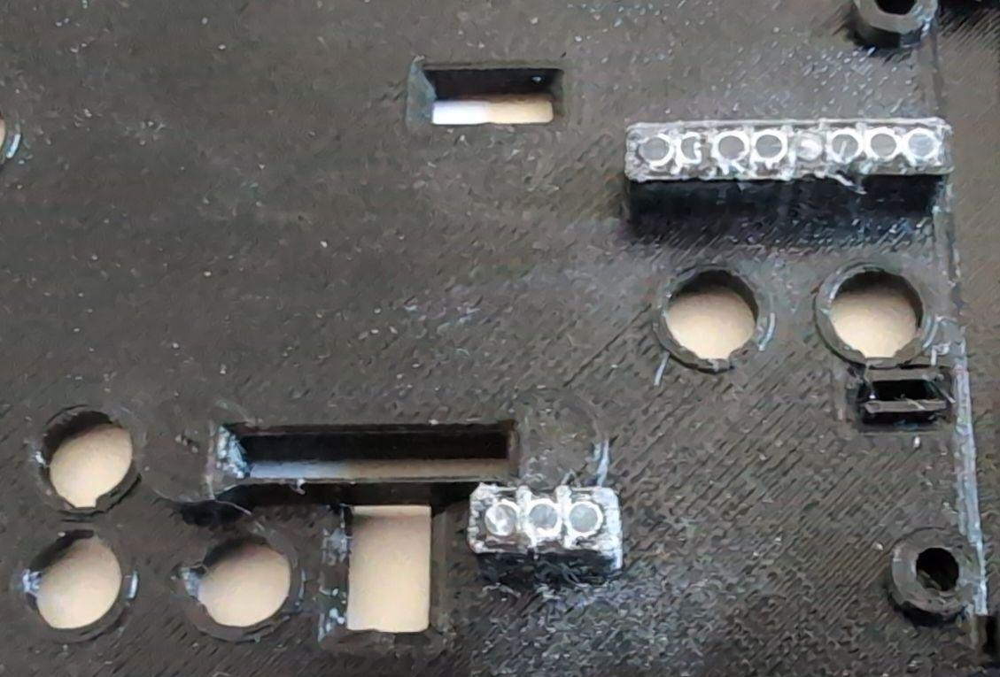</a>

If the light pipe fiber optic filaments are too long, the enclosure face will have a slight bulge and the F1 and F2 buttons will not extend as far as the other buttons.
This condition puts strain on the PC board, which may shorten its life.

### HDMI Stub-out

When using the internal HDMI connector, the external HDMI and display touch USB connectors should be stubbed out to ensure they are not used concurrently (see documentation).

### Keyhole Adapter

The ULX3S side of the enclosure includes a keyhole in case you have a project to hang on the wall.

If using the keyhole-to-lanyard adapter, install the one brass insert in the rear (internal) circular disc.

Only install the inserts. Do not mount the keyhole screen at this time to allow the display to lay flat during assembly.

### Display Blank (optional)

If using the blank panel instead of an HDMI display, place the 4 mounting post inserts for the ULX3S and the 2 display posts used for the mounting brackets. There are 2 display mounting post holes included in the mock-up to match the real display but are not used.

<a href="./images/display_blank_installed.jpg" target="_blank">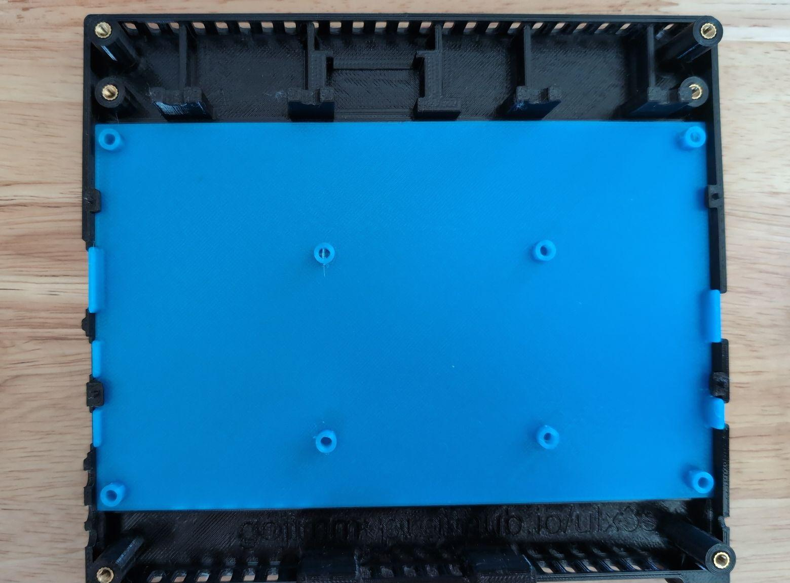</a>

Due to the recessed panel thickness on the left HDMI / USB side, the enclosure alignment post clips are slightly wider than those on the right.

First insert the left side of the HDMI display observing the snap-clips on each side of the enclosure.

<a href="./images/display_blank_left_insertion.jpg" target="_blank">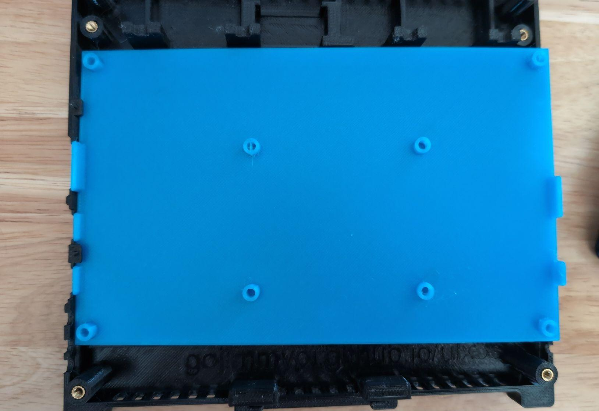</a>

The left (HDMI/USB) display enclosure side has slightly thicker snap-in posts. First insert the display on the left.

Ensure the display is snug and resting underneath the snap-in guides.

Lower and press the right side into place while gently pulling the right side panel out. Snap the display into place.
Note the connectors that are stubbed out as part of the display mock-up.

<a href="./images/display_blank_stubout_view.jpg" target="_blank">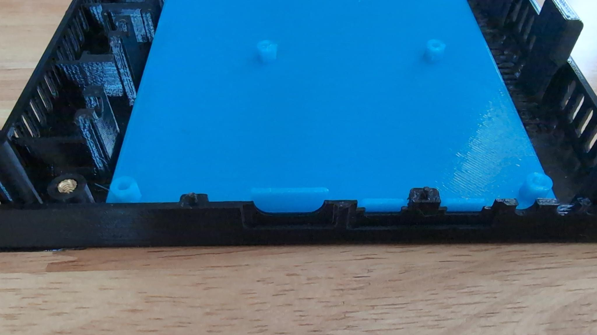</a>

## Install Display Assembly into Enclosure

Due to the recessed panel thickness on the left HDMI / USB side, the alignment post clips are slightly larger than those on the right.

First insert the left side of the HDMI display observing the snap-clips on each side of the enclosure.

<a href="./images/display_left_insertion.jpg" target="_blank">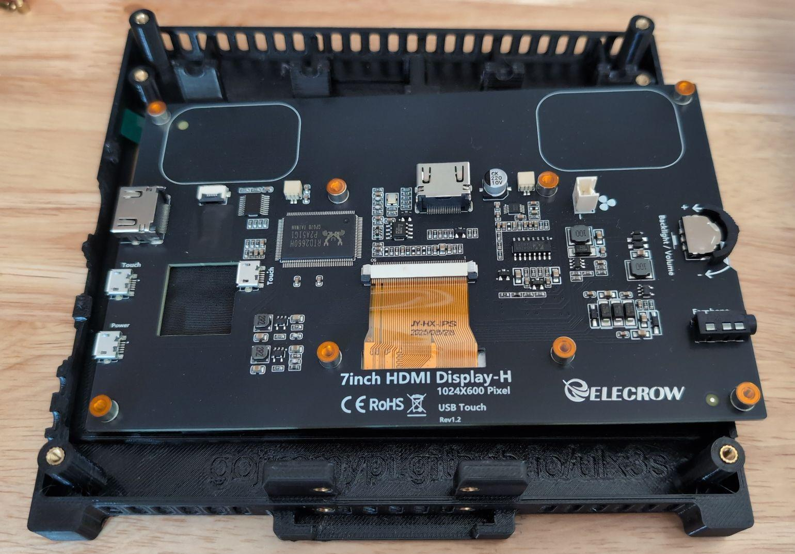</a>

Lower the right side into place while gently pulling the side panel out and snap the display into place.

Remove orange kapton tape covering top 2 display mounting post M2.5 holes (if present). The bottom 2 posts are not used.

## Mount ULX3S to Display (or Mock-up)

These steps apply to either the HDMI display, or the optional mock-up (above) which has mounting posts in the same locations.

### Install ULX3S to Raspberry Pi Mounting Adapter

The Elecrow display was designed for the Raspberry Pi, not the ULX3S. As such, the display mounting posts do not line up with the holes on the ULX3S:

### Install Mounting Adapter Spacers

Ensure the 2 Mounting Adapter Spacers are installed underneath the Mounting Adapter first. These spacers should be the same height as the metal
spacers on the display. Do not confuse these two spacers with the 4 optional face spacers. The adapter spacers have a single printed layer on one end (no visible hole)
to protect the display from the metal insert. The side with the hole also has no chamfer, as the screw enters from the adapter side.

<a href="./images/ulx3s-mounting-adpater-underside.jpg" target="_blank">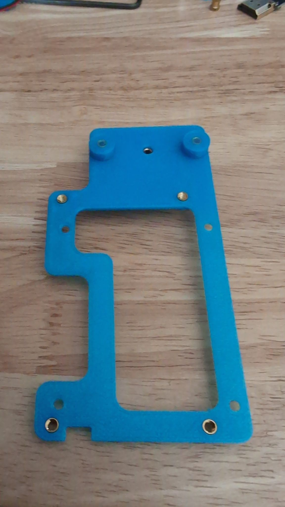</a>

Place the Mounting Adapter over the 4 Raspberry Pi positioned M2.5 mounting posts.

<a href="./images/elecrow-display-rpi-posts.jpg" target="_blank">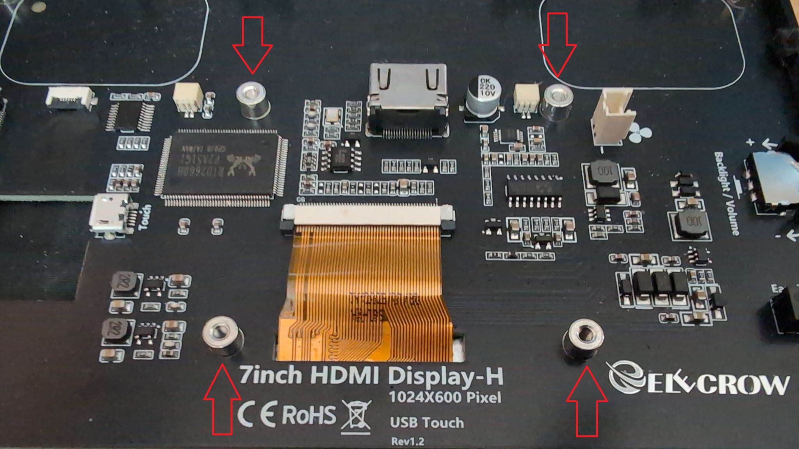</a>

Secure the adapter to the display with either the 4 screws that should have been included with the display, or other M2.5 x 4 mm screws.

Beware of components on the bottom side of the ULX3S that may collide with thick pan head screws or spacers.

<a href="./images/ULX3S-Mounting-Adapter-with-strain-relief.jpg" target="_blank">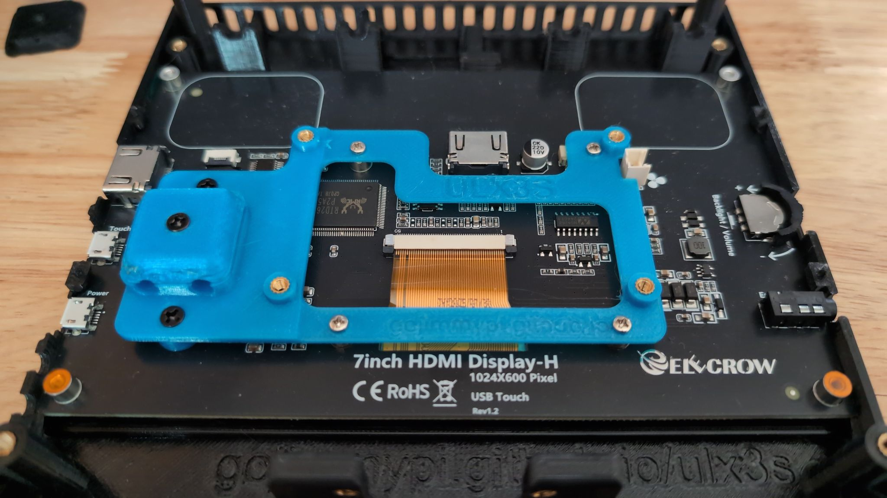</a>

Before proceeding, ensure the spacers are installed under the strain relief as described above.

Confirm that no display components will be crushed under the strain relief. This is unlikely, but there's no guarantee
that a future version of the display won't relocate some components.

### Connect the A1-A1 HDMI

When using the A1-A1 HDMI PC Board adapter, there's very little room between the mounting posts
and the ULX3S, particularly since there are components on both sides of the board.

As the HDMI display was designed to be used with the Raspberry Pi, use the custom adapter:

<a href="./images/ULX3S-Mounting-Adapter.jpg" target="_blank">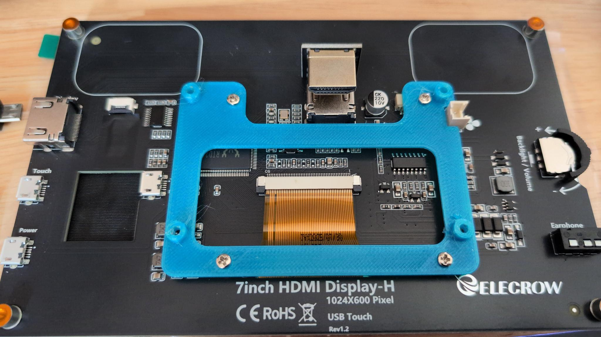</a>

After the adapter is secured to the display, attach the ULX3S:

<a href="./images/ULX3S-Mounting-Adapter-with-PCB.jpg" target="_blank">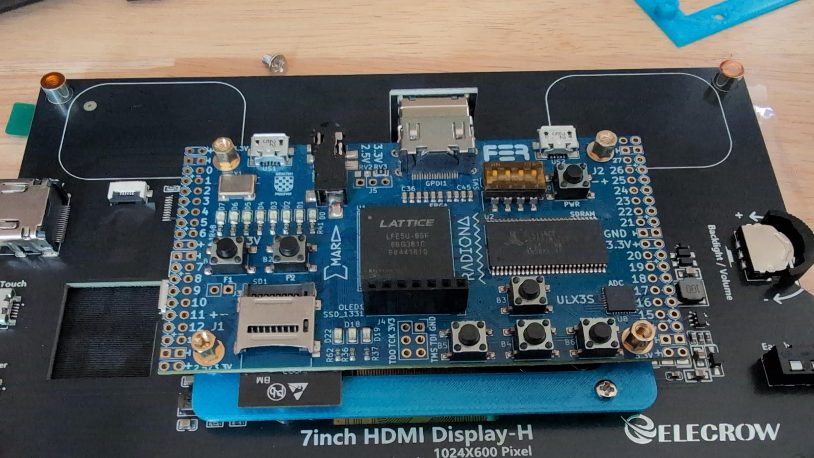</a>

Next, carefully insert the A1-A1 HDMI connector:

<a href="./images/A1-A1-connector.jpg" target="_blank">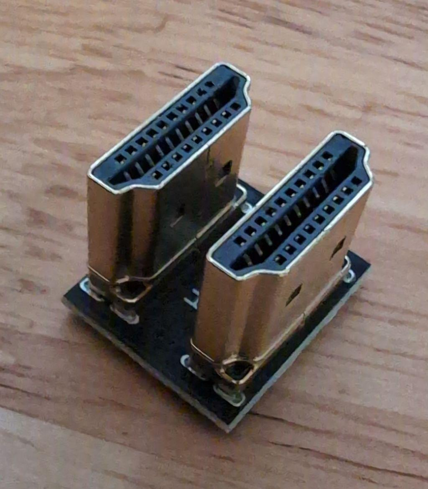</a>

Note the clearance between the ULX3S. There's an unfortunate placement of a white 2-pin header on the display directly below the J2 4 pin header.

<a href="./images/ULX3S-clearance-view.jpg" target="_blank">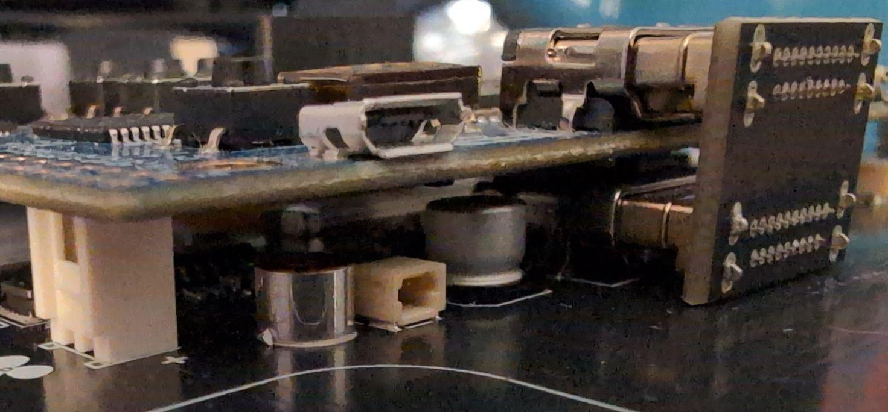</a>

If there is no A1-A1 adapter board available, there's enough room for a [short 10 cm A1-A1](https://www.amazon.com/dp/B0F1TBRSMZ/ref=dp_iou_view_item?ie=UTF8&psc=1).

Use caution with the Amazon links that redirect to similar, but _incompatible_ connectors when out of stock.
*There's only room for the A1-A1*, not any of the angled connectors (e.g. A1-A2, A1-A3). The reversed position connector is not recommended as the cable would need to be twisted (e.g. A1-C1).

For reference, see the A1 options for HDMI cables:

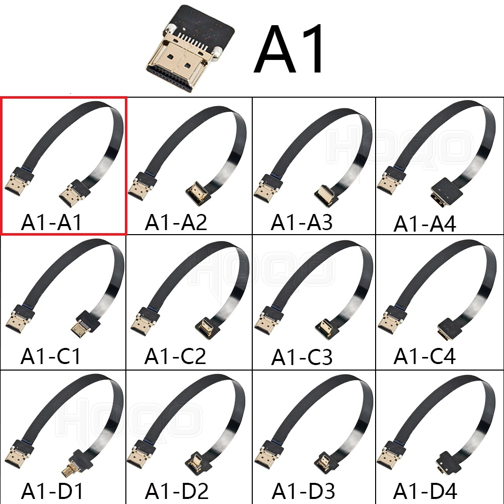

## Place Buttons in ULX3S side

There is a small connecting strip (roadway) that keeps all buttons together during printing.
This ensures the model is treated as a single body during printing and helps prevent parts from being lost during handling.

When printed with PETG, the roadway connections between buttons should be flexible enough to no interfere
with button operation.

Lay the back of the enclosure (ULX3S side) face down and carefully identify and place each button in the respective holes.

Note that there are some orientation posts on the button shafts to ensure specific alignment and prevent rotation.

There are two button roadway clips built into the enclosure face. Snap the roadways in place as shown:

<a href="./images/white_buttons-with-roadway-clip.jpg" target="_blank">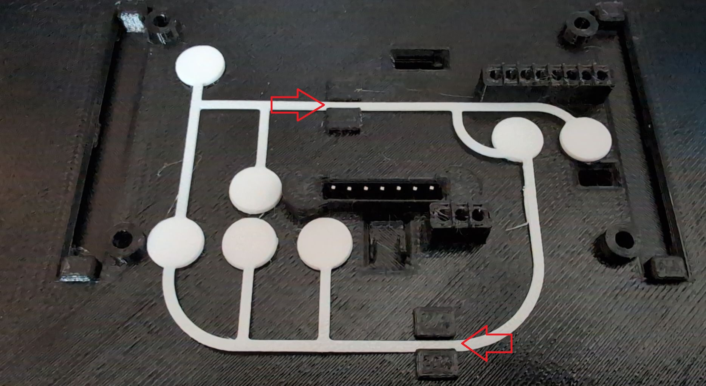</a>

The roadway clips are only intended to help keep the button set from falling out when handling the enclosure.

## Place the HDMI Stub-out

** WARNING **  Do not attempt to use the external HDMI connector when display connected also to the ULX3S internally.

To ensure the second display HDMI connector is not inadvertently used, install the HDMI stub-out panel to block access to the external HDMI connector.

<a href="./images/HDMI_USB_stubout_view.jpg" target="_blank">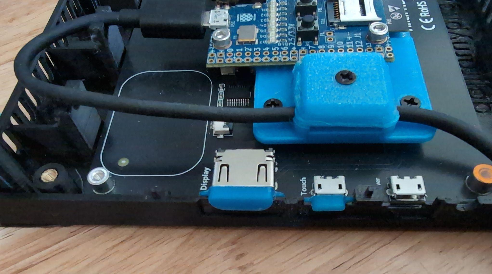</a>

Note there are _two_ Elecrow display USB Micro-B connectors: `Touch` and `Power`. Pick _one_, stub out the other. Typically the `Touch` will be stubbed out unless
there's some logic and/or electrical connections to feed back the touch signals to the ULX3S or ESP32 for processing. The HDMI and first adjacent USB connector can remain connected as printed.

Unless some other means of power the display is implemented, at least one of the display USB connectors must be used.

As the HDMI and USB stub-outs are very small, consider a dab of glue to hold them in place.

## Route Internal USB Cable(s)

Unless the FPGA is programmed to retain an HDL binary image, a USB cable will be needed for (re-)programming after power down.

The connector to the _left_ (when viewed from the FPGA side and the HDMI connector at the top), `US1`, is the one for FPGA programming:

<a href="./images/USB_single_cable_internal_routing.jpg" target="_blank">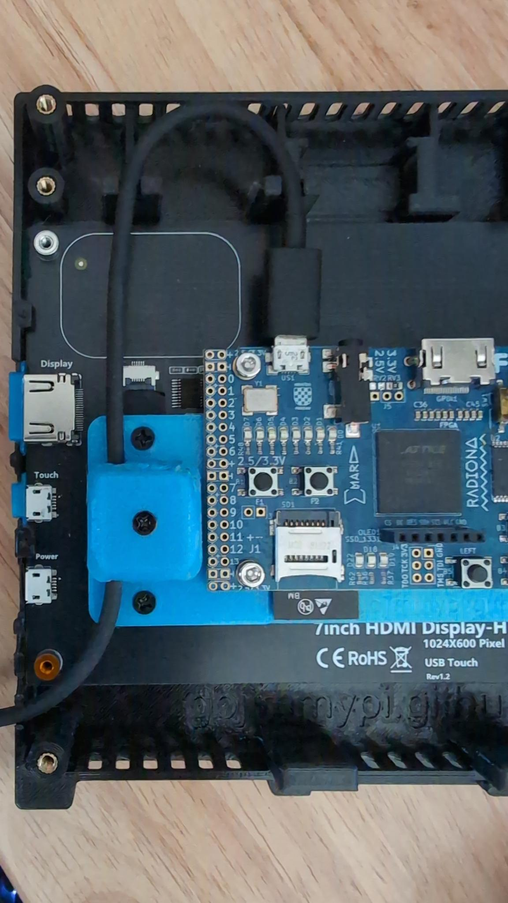</a>

If `US2` (e.g. USB HID, keyboard, USB host) is also desired to be accessible once the display is assembled, route it as well.

<a href="./images/USB_dual_cable_internal_routing.jpg" target="_blank">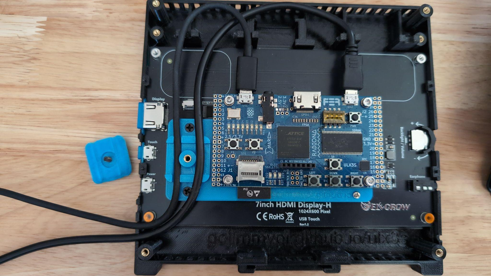</a>

Note that a USB controller will need to be implemented in the FPGA when using `US2`.

## Internal Fan

If planning to use an internal fan, ensure the USB cables are routed appropriately.

<a href="./images/fan_with_wire.jpg" target="_blank">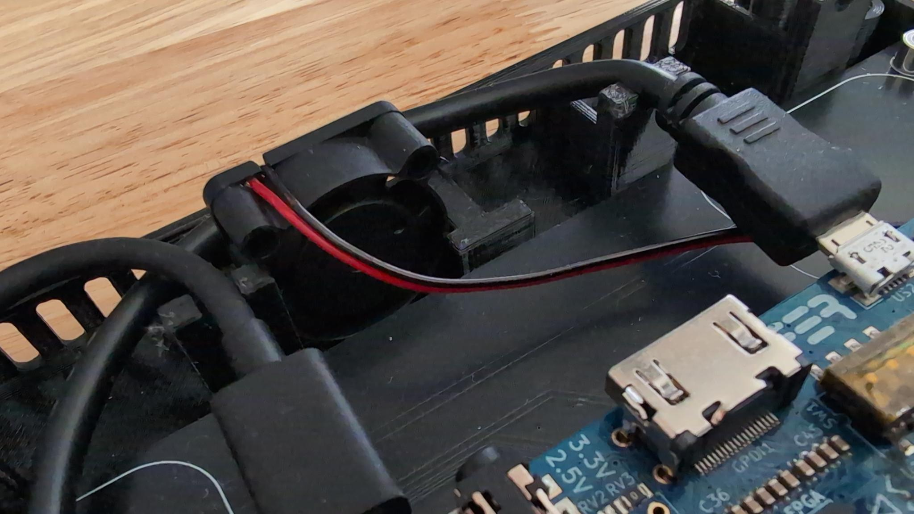</a>

The bottom two mounting posts for the display are not used. **Note:** The ULX3S side includes internal support posts that align with these positions. Do not obstruct them.

## Assemble Mounting Post Stand (optional)

When 3D printed with a brim, ensure any excess material is removed from the ULX3S side.
The plate should be snug but not too tight.

Secure the mounting plate to the stand. Note one side of the plate has a chamfered hole to allow the screw to be flush with the surface:

<a href="./images/stand_top_screws.jpg" target="_blank">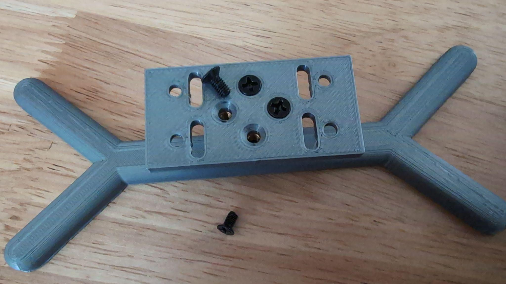</a>

Install all 4 screws before gradually tightening each in succession. Do not over-tighten to the point of deforming the plastic.

The stand can be left attached to the _front_ display half when opening the enclosure.

Slide the stand assembly into the enclosure slot. allowing the stand feet to hang over the work surface:

<a href="./images/stand_attach.jpg" target="_blank">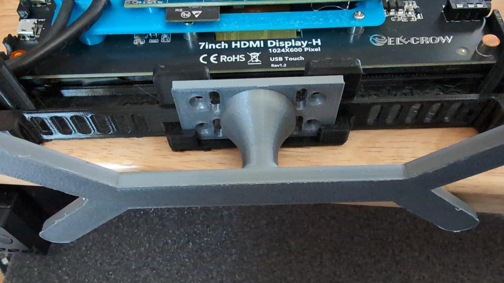</a>

Secure the stand base plate to the display side of the enclosure only, using the two M3 screws near the work surface. Do not install the other base plate screws at this time.

<a href="./images/stand_attachment.jpg" target="_blank">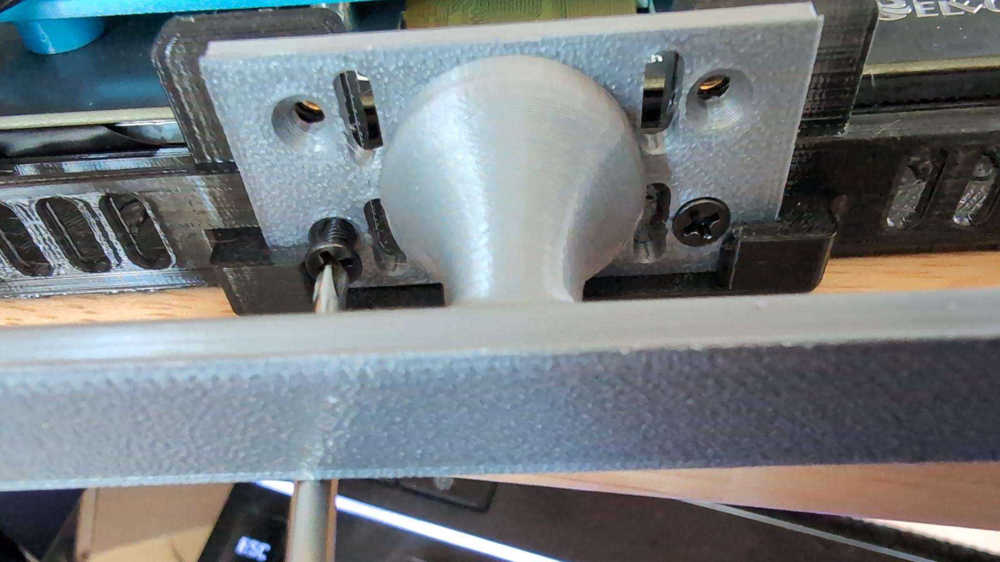</a>

## Assemble Lanyard Keyhole Adapter (optional)

TODO

## Attach OLED Frame with SSD 1331 Display (Optional)

Only two screws are used to secure the OLED frame to the enclosure. Note that the frame covers the
`J5` connector.

There are two tabs at the end opposite the OLED Face frame notch. Insert the display at an angle there first:

<a href="./images/oled_insert-this-side-first.jpg" target="_blank">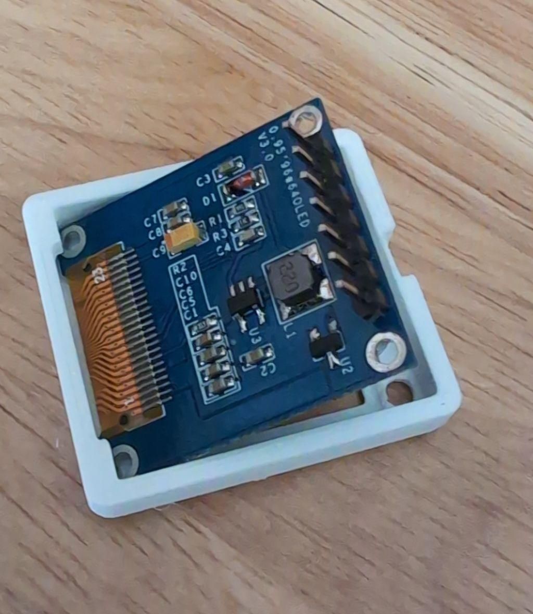</a>

Next, gently press the display into the face frame. The 7 pin header should be flush with the frame:

<a href="./images/oled_installed_faceframe.jpg" target="_blank">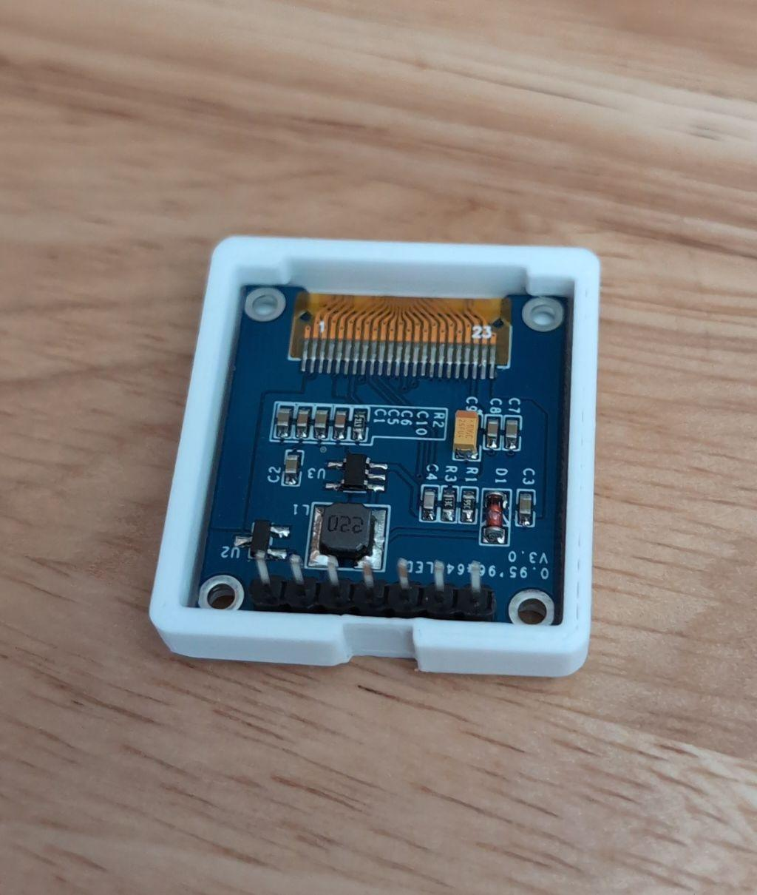</a>

Note the alignment of the display pins into the enclosure. (assumes header has been installed: see prior instructions)

<a href="./images/oled_pins_ready.jpg" target="_blank">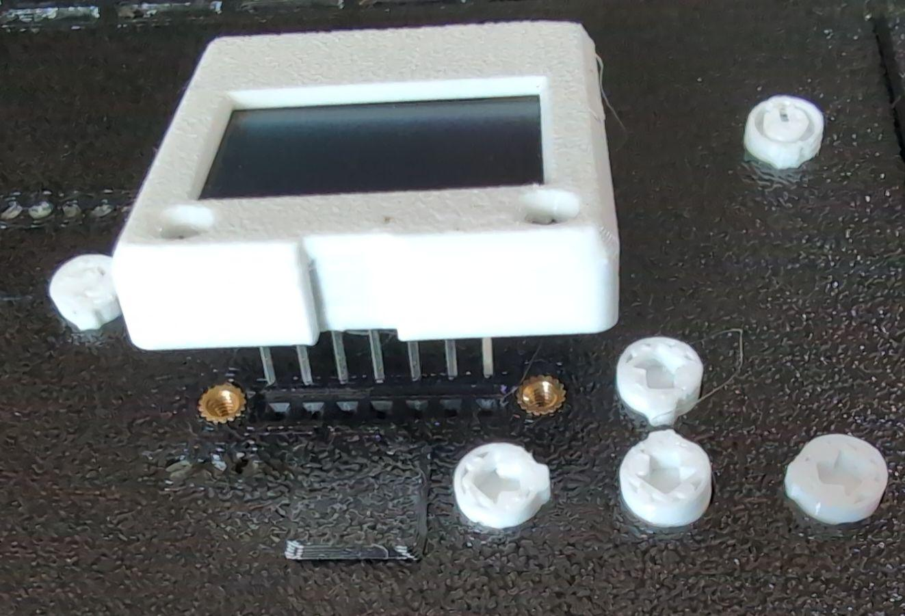</a>

Once plugged in, attach the OLED Face Frame to the enclosure with 2 screws: M2 x 10 mm

<a href="./images/oled_faceframe_screws.jpg" target="_blank">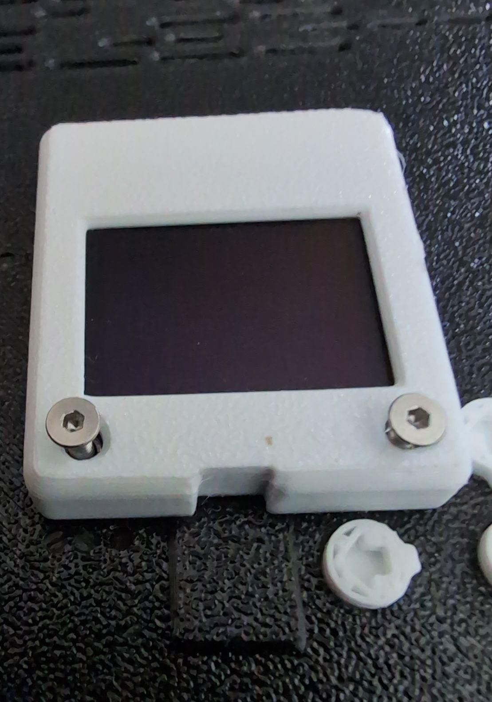</a>

## Attach Front Display and Rear ULX3S Sides of Enclosure Together

As the OLED frame (see prior step) extends nearly 7 mm from the face of the enclosure, consider
whether spacers should be used in each of the corners of the face. When used in a lay-flat configuration
with the HDMI side facing up, the spacers stabilize the enclosure on the workbench.

Use 4 of the M3 x 4 mm screws: one in each corner of the ULX3S face to
secure the two sides of the enclosure together. Ensure no internal obstructions (e.g., wires over mounting posts or fan placement issues) before closing the enclosure.

Screws up to M3 x 20 mm can be used, allowing the flexibility of the optional OLED frame face spacers.

## Problems, Questions, Comments?

- Open a [GitHub issue at github.com/gojimmypi/ulx3s-elecrow-7inch-hdmi-enclosure](https://github.com/gojimmypi/ulx3s-elecrow-7inch-hdmi-enclosure/issues/new)

- Send me an email (at gmail).

- Contact me on your favorite social media. See links at the top of [gojimmypi.github.io](https://gojimmypi.github.io/)

## Enjoy!

Proceed to learn more about FPGA programming by visiting [Bruno Levy's "Learning FPGA, yosys, nextpnr, and RISC-V"](https://github.com/BrunoLevy/learn-fpga)
and reading FPGA Books such as [Kevin Hubbard's Mastering FPGA Chip Design](https://www.elektor.com/products/mastering-fpga-chip-design-e-book) (See the [extract](https://issuu.com/eimworld/docs/mastering_fpga_chip_design_extract_)).

There's a [Pull Request to add ULX3S HDMI resolutions for displays such as an Elecrow HDMI display](https://github.com/BrunoLevy/learn-fpga/pull/146).

See also [ulx3s.github.io/](https://ulx3s.github.io/) and reach out on [Discord](https://discord.com/channels/690209441953480758/1081150712479764530) with any questions.

