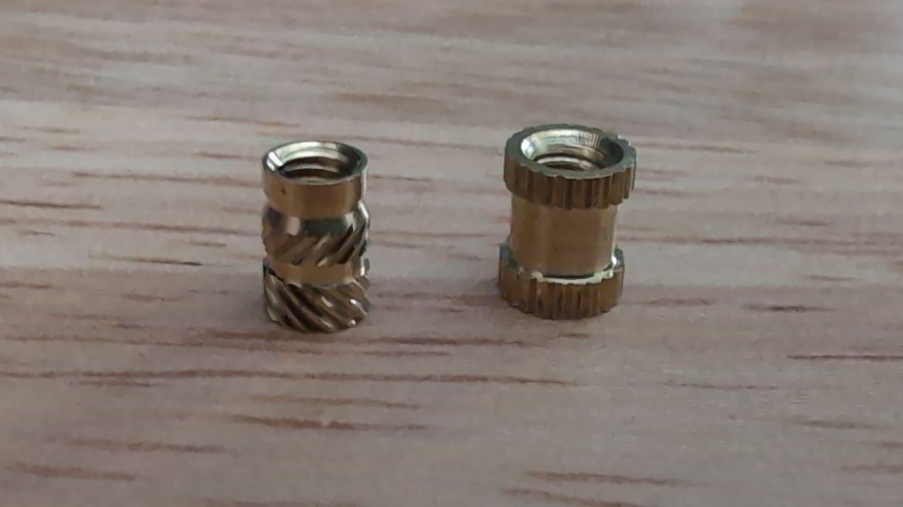
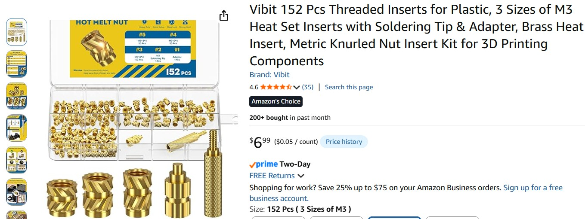

# Quick Start

The [ASSEMBLY](./ASSEMBLY.md) instructions contain details for the various options.

There are only 3 essential parts:

| Part | Description |
| ---- | ----------- |
| <a href="./images/part_ULX3S_To_RPi_Elecrow_Adapter.jpg" target="_blank"></a> | Adapter Mounting Bracket with internal USB restraint |
| <a href="./images/part_enclosure_ulx3s_side.jpg" target="_blank"></a> | Enclosure ULX3S Side |
| <a href="./images/part_enclosure_display_side.jpg" target="_blank"></a> | Enclosure Display Side |

The holes for heat set inserts are size for the type with a little lip on one end as seen on the left:

<a href="./images/two_types_of_heat_set_inserts.jpg" target="_blank"></a>

Most screws are [Philips M3](https://www.amazon.com/dp/B0FZTYBXPY). The HDMI Display use M2.5, and the OLED mount uses M2.

[These M3 inserts](https://www.amazon.com/dp/B0FWWW8VP1) were used:

<a href="./images/amazon_m3_heat_set_inserts.jpg" target="_blank"></a>

## Assembly

Secure the mounting adapter to the display, then attach the ULX3S to the adapter.

Be sure to install the A1-A1 HDMI connector between the ULX3S and the display.

See the [ASSEMBLY](./ASSEMBLY.md) instructions for more details.

## Bit files

See the pre-built binaries in the [bitfiles](./bitfiles/README.md) directory.

```bash
fujprog HDMI_test_hires.bit
```
