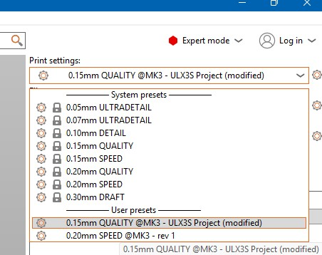
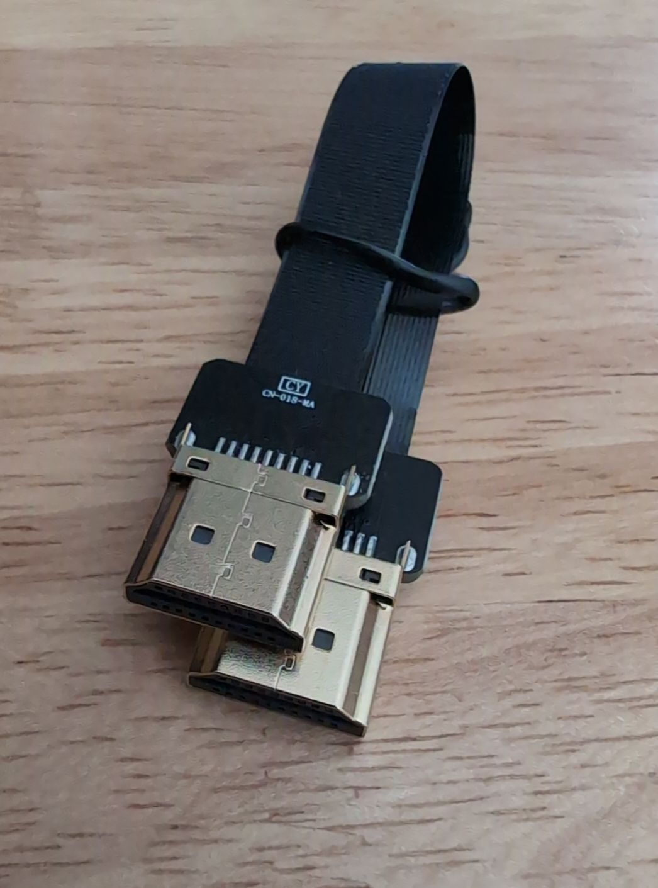

# ULX3S 7inch HDMI Diplay-H Elecrow Enclosure

This is an enclosure for the [ULX3S FPGA + ESP32](https://radiona.org/ulx3s/) development and educational board
for use with the [Elecrow 7 inch HDMI display](https://www.elecrow.com/rc070s-7-inch-1024-600-ips-hdmi-capacitive-touch-monitor.html),
such as [this one available on Amazon](https://www.amazon.com/dp/B08FMNDDSL).

The enclosure is not perfect. Some minor remaining ideas for improvement are in the [To-Do list](./TODO.md).

See related links:

- [ULX3S Crowd Supply Campaign](https://www.crowdsupply.com/radiona/ulx3s)
- [ULS3S from Mouser](https://www.mouser.com/c/?q=ulx3s)
- [Elecrow HDMI display from Amazon](https://www.amazon.com/dp/B08FMNDDSL) on Amazon
- [ulx3s.github.io](https://ulx3s.github.io/) for some sample ULX3S projects

## Warnings

- Don't use external and internal HDMI concurrently. Pick one.
- Don't use USB Touch and USB Power connectors at the same time. Pick one.
- Experimental FPGA Programming of an HDMI display may result in pseudo "burn-in". See [YouTube video](https://www.youtube.com/watch?v=WJaRHJX4xYA) to resolve.

## Specification Summary

Designed with Autodesk Fusion for the [Prusa MK3S 3D Printer](https://help.prusa3d.com/product/mk3s) using PETG Filament.
Sliced with PrusaSlicer 2.9.4.

The latest [Prusa MK3S](https://help.prusa3d.com/product/mk3s) firmware was used: [`MK3S_MK3S+_FW_3.14.1_MULTILANG.hex`](https://www.prusa3d.com/downloads/firmware/prusa3d_fw_3_14_1_MK3S.zip).
There's a copy [here](./firmware/). Note this version is completely intolerant to intermittent sensor failures. See [MINTEMP BED error](https://help.prusa3d.com/article/mintemp-error-and-mintemp-bed_2169).

#### Default Fusion settings:

- Refinement: Medium
- Surface Deviation: 0.036706 mm
- Normal Deviation: 15.00 (angular tolerance in degrees)
- Maximum Edge: 231.60045 mm (no practical limit)
- Aspect Ration: 21.5 (Controls how "skinny" triangles are allowed to be)

#### 3D Printer Settings:

- Material: PETG
- Ambient temperature: > 75F
- Print Setting: 0.15 Quality (each layer thickness)
- Nozzle: 0.4 mm
- Filament: 1.75 mm
- First Layer: 240 degrees C
- Other layers: 236 degrees C
- Bed: 85 degrees C
- Otherwise defaults in PrusaSlicer version 2.9.4

Note the 0.4 mm nozzle and 0.15 layer height are coded in the Fusion parameters. ymmv with other print settings.

## 3D Printing Files

There are Autodesk Fusion STL files in the [STL](./STL/README.md) directory for printing to any device.

Prototypes were all created using PETG filament. Other filaments may be used. Note the snap-in nature of
the display expects the right (audio) side of the enclosure to have a bit of flex during assembly.

#### Prusa Files

The Pruse Slicer Project files and G-Code are in the [Prusa](./Prusa/README.md) directory.
Included are `PrusaSlicer_config_bundle.ini` files for the MK3S, but should adapt easily to other printers.

To [get started](./QUICK_START.md) quickly, printing all parts for the Prusa slicer, see:

- `Enclosure Display Side.3mf` 
   
- `Enclosure ULX3S Side.3mf` 
 
- `Small parts.3mf` 
  
- `Adapter Base Plate Set.3mf` 
  

Note that the buttons are includes in the small parts set. If a separate color is desired for only the buttons, see the `Button Set` files.  
- 

The "0.15 Quality" has some critical changes in the `User Presets - 0.15mm QUALITY @MK3 - ULX3S Project`
that were observed to make a difference between print success and failure.

In particular not these changes from defaults:

- print_settings_id = 0.15mm QUALITY @MK3 - ULX3S Project

- seam_position = rear

- brim_width = 5 (can be set to zero if in a warm, stable environment)

- first_layer_speed = 15

- first_layer_extrusion_width = 0.5

- elefant_foot_compensation = 0.05

Other settings to consider:

- Increase infill to 20 - 30% (main print settings)

- Increase the number of perimeters from 2 to 3. (Print Settings - Layers and Perimeters - Vertical shells - Perimeters)

## Compatibility Issues

The Elecrow display was designed for the Raspberry Pi, not the ULX3S. As such there are some minor physical positioning items to consider:

- USB2 / US2 vs Speaker.

  When mounted directly on the Elecrow display, the second USB connector on the ULX3S does not have room to be plugged in with the default speaker position.

  Consider rotating the speaker at an angle to ensure the USB cable can be inserted.

  Plug in the speakers, mount the ULX3S to the display first, then consider USB cable routing before securing speakers to display.

- J2 Header vs Fan Header

  The onboard fan connector header for the Elecrow display fan is directly under some of the J2 header pins.
  The fit is so tight that soldered leads may need to be trimmed and/or the plastic header trimmed.

  It is unlikely that the fan header connector can be used. No fan is typically included with the display.

- Audio

  The Elecrow HDMI Display will typically pass through audio on the HDMI interface. For an FPGA board such as the ULX3S, the audio would _need to be implemented in HDL_.

  The external audio connector is for optional headphones.

  There's also an onboard audio connector for the ULX3S. There's an optional exit hole to route the audio out from the ULX3S.

- HDMI

  The ULX3S has a pin-_compatible_ GPDI (General-Purpose Differential Interface). To use this with an HDMI display, the appropriate HDL needs to be implemented on the FPGA. See the [Bruno Levy example](https://github.com/BrunoLevy/learn-fpga/tree/master/Basic/ULX3S/ULX3S_hdmi).

  Do **NOT** use the side panel Elecrow Display HDMI concurrently with the ULX3S connected internally.

  The mini-PC Board HDMI-to-HDMI connector is not specified as being included on all Elecrow product listing at various vendors. If _not_ included, there's room to use an [A1-A1 FPC (Flexible PC)](https://www.amazon.com/dp/B01787KZVG) HDMI Cable. Note some A1 cables reverse one of the HDMI connectors. The desired orientation is having both narrow sides in the same orientation:

  

  Note when using the ribbon cable HDMI connector, there may be mechanical interference with optional internal fan and/or keyhole mount.

## Features

- Buttons for ULX3S: PWR, F1, F2, Left, Right, Up, Down
- Light pipe mounting blocks for `D0` - `D7` (blinky) and `D18` (PWREN), `D9` (TXLED), `D22` (WIFI): Tight fit 2mm fiber optic cable max diameter.
- External panel access to J1 and J2 GPIO 40 pin header with optional cover.
- External panel access to J3 (GND and WIFI_OFF: ESP32 EN)
- External panel access to J4 JTAG 6 pin header: `3v3`, `GND`, `TDO`, `TDI`, `TCK`, `TMS`.
- External Panel access to J5 VJ1 `+3v3` and `+2v5`, pin 2 is `2V5_3V3` (note: covered when using OLED frame)
- External Elecrow HDMI connection. (**WARNING**: Not to be used concurrently with ULX3S HDMI)
- External Micro-B USB connector for display power.
- External Micro-B USB connector for optional display touch control.
- External access to Display Brightness / Volume control.
- External SRRS mounting hole for ULX3S audio output.
- Audio: 3.5 mm jack with 4 contacts (analog stereo + digital audio or composite video)
- Optional mounting stand.
- Optional OLED display frame for [0.95" 7 pin SPI SSD1331 OLED Display](https://www.amazon.com/dp/B0711RKXB5/)
- Optional feet (same thickness as the OLED display frame) for using the display horizontally during development.
- Optional keyhole for wall mounting: Slightly offset to one side to balance internals.
- Optional internal slot for [25mm x 10mm 5V fan](https://www.amazon.com/dp/B07KRX9F99).
- Optional face screws for securing ULS3S directly to enclosure. Hole is nearly to surface, poke to use with 4 mm standoffs.
- Internal USB cable routing.
- Internal FPC HDMI cable routing.
- Exit holes for USB cables routed internally from ULX3S. See adapter strain relief block.
- Adjustable positioning for the display. See left and right display brackets.
- Air vents in the top and bottom. (assuming a vertical orientation of display)
- Optional `(Hex Head)`-suffixed files for Stand Mounting Plate and Display Brackets where screw clearance is critical. The default is Philips.

## Assembly

The enclosure was designed to have the ULX3S mounted inside. This means that the USB connectors require internal cable routing.

See [ASSEMBLY.md](./ASSEMBLY.md) for further details.

### Display

The display snaps into place. There is a bit of up-down play available, as the technical diagram did not reference the display positon with respect to the attached display driver PC board. Once snapped into place, manually align the USB ports on the left and the audio cable on the right. Plus in a USB cable and audio cable to ensure proper alignment, then fix the display in place with the brackets.

Insert a USB Micro-B cable on one side of the enclosure and ideally an audio cable on the other to ensure alignment of the display board with the enclosure.

Once alignment has been verified, install the display mounting brackets and tighten the screws.

### Speakers

Ensure the ULX3S board is mounted first. There's a tight fit between the speaker and PC Board.

### HDMI Connection

There's a tight vertical clearance between the HDMI-HDMI connector board at the underside of the ULX3S. Consider insulsting kapton or electrical tape.

**WARNING** Do not use the external HDMI connection while the ULX3S is connected internally. Consider keeping a cover in place.

## Files

- [bitfiles](./bitfiles/README.md) - Prebuilt FPGA files to get started quickly.
- [firmware](./firmware/README.md) - Firmware `.hex` files for Prusa MK3S printers.
- [Fusion/ExportedParameters.csv](./Fusion/ExportedParameters.csv) - Parameters defined in Autodesk Fusion.
- [Prusa](./Prusa/README.md) - Prusa Slicer Projects and G-Code for the MK3S.
- [Prusa/PrusaSlicer_config_bundle.ini](./Prusa/PrusaSlicer_config_bundle.ini) - Prusa MK3S settings used.
- [STL](./STL/README.md) - Enclosure and all parts in STL format printed from Autodesk Fusion.

## Published Files

Currently the original official; files are only located at https://github.com/gojimmypi/ulx3s-elecrow-7inch-hdmi-enclosure

TODO publish to other locations:

- https://www.printables.com/@gojimmypi_17688
- https://www.thingiverse.com/gojimmypi/designs
- https://www.etsy.com/people/gojimmypi
- https://www.elecrow.com/share-projects.html

## License

See [LICENSE](./LICENSE). In short:

The [Creative Commons Attribution–NonCommercial–ShareAlike 4.0 International (CC BY-NC-SA 4.0) license](https://creativecommons.org/licenses/by-nc-sa/4.0/)
lets anyone copy, share, and modify this enclosure design worldwide and royalty-free, as long as users

- (1) give proper attribution
- (2) use it only for non-commercial purposes
- (3) distribute any modified versions under the same license (ShareAlike).

It is irrevocable provided users follow the terms, does not grant patent or trademark rights,
and includes strong warranty and liability disclaimers (the work is provided "as-is").
If someone violates the terms, their rights terminate automatically but can be reinstated
if they fix the issue within 30 days. In short, it allows open collaboration and remixing,
but blocks commercial use and requires derivatives to stay under the same non-commercial license.

A commercial license is available. Contact me: https://gojimmypi.github.io/

## Links

- [Prusa How to update firmware (MK3S+/MK3S/MK3)](https://help.prusa3d.com/article/how-to-update-firmware-mk3s-mk3s-mk3_2227)
- [CrowdSupply ulx3s](https://www.crowdsupply.com/radiona/ulx3s)
- [Prusa Help: Layers and perimeters, detect thin walls](https://help.prusa3d.com/article/layers-and-perimeters_1748#detect-thin-walls)
- [Prusa Help: Seam position](https://help.prusa3d.com/article/seam-position_151069)
- [Digilent Pmod and FPGA: Connection Guide](https://digilent.com/blog/where-to-plug-in-your-pmod-fpga/)
- [openFPGALoader WEB interface - ofl.trabucayre.com ](https://ofl.trabucayre.com/), from [github.com/trabucayre/openFPGALoader](https://github.com/trabucayre/openFPGALoader)
- [ULX3S examples from the Legendary Lawrie Griffiths](https://github.com/lawrie/ulx3s_examples/tree/master)
